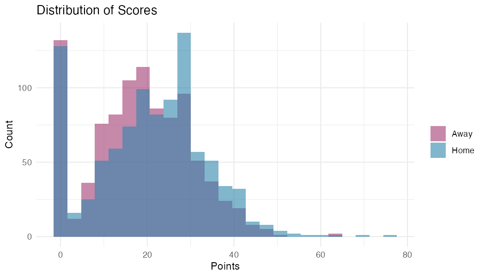
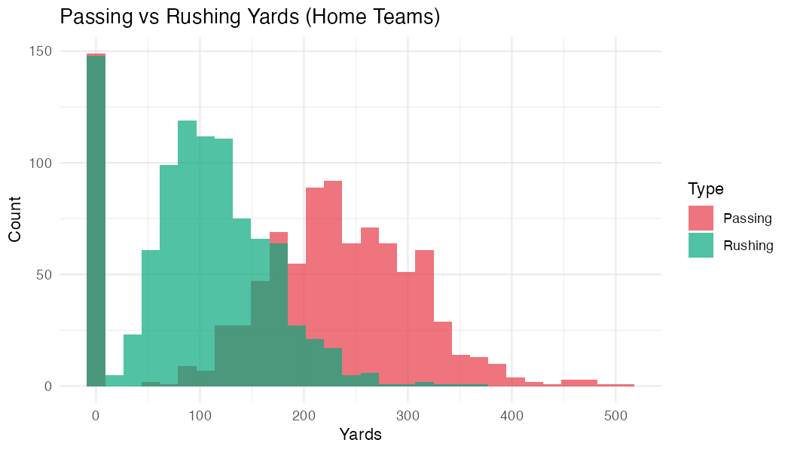
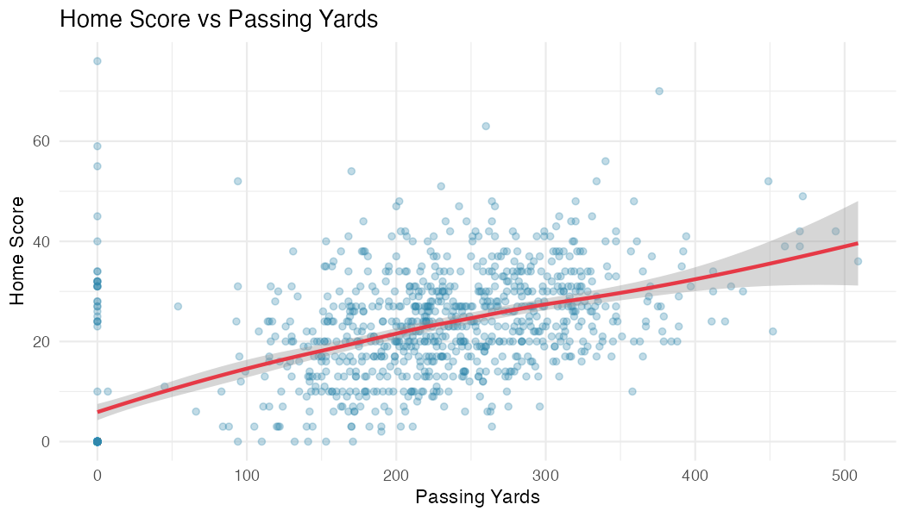

# NFL Game Statistics: Descriptive Statistics & EDA

**Generated:** 2025-11-23 20:27:16

**Dataset:** 966 games × 82 variables

---

## Dataset Overview

- **Seasons:** 2022, 2023, 2024, 2025
- **Weeks:** 1 to 18
- **Teams:** 35 unique
- **Games:** 966

### Games by Season

- 2022: 108 games
- 2023: 286 games
- 2024: 286 games
- 2025: 286 games

## Missing Data Analysis

| Variable | Missing | Percent |
|----------|---------|---------|
| last_met_date | 966 | 100.0% |
| kickoff_time | 124 | 12.8% |
| stadium | 124 | 12.8% |
| day | 124 | 12.8% |
| time | 124 | 12.8% |

## Descriptive Statistics

### Scores

| Metric | Home | Away |
|--------|------|------|
| Mean | 20.9 | 18.6 |
| Median | 22.0 | 19.0 |
| SD | 12.6 | 11.5 |

**Home field advantage:** 2.35 points (home mean - away mean)

### Key Offensive Statistics (Mean ± SD)

| Stat | Home | Away |
|------|------|------|
| passing yards | 202.1 ± 108.1 | 192.5 ± 104.0 |
| rushing yards | 101.1 ± 64.2 | 97.2 ± 61.2 |
| passing touchdowns | 1.3 ± 1.2 | 1.2 ± 1.1 |
| rushing touchdowns | 0.8 ± 0.9 | 0.7 ± 0.9 |
| turnovers | 1.1 ± 1.1 | 1.1 ± 1.2 |

## Key Distributions

### Score Distributions

### Passing vs Rushing Yards

## Bivariate Relationships

### Score vs Passing Yards (Home Teams)

**Correlation:** 0.591

## Data Files Reference

- **game_results.csv**: Basic game results with scores and metadata
- **game_stats.csv**: Detailed statistics (78 columns)
- **games_full.csv**: Complete dataset (game_stats + metadata = 82 columns)

**Note:** possession_seconds columns removed (all zeros).

To append new seasons: rerun `Rscript R/process_game_stats.R --seasons 2022,2023,2024,2025,YYYY`

---
*End of Report*
