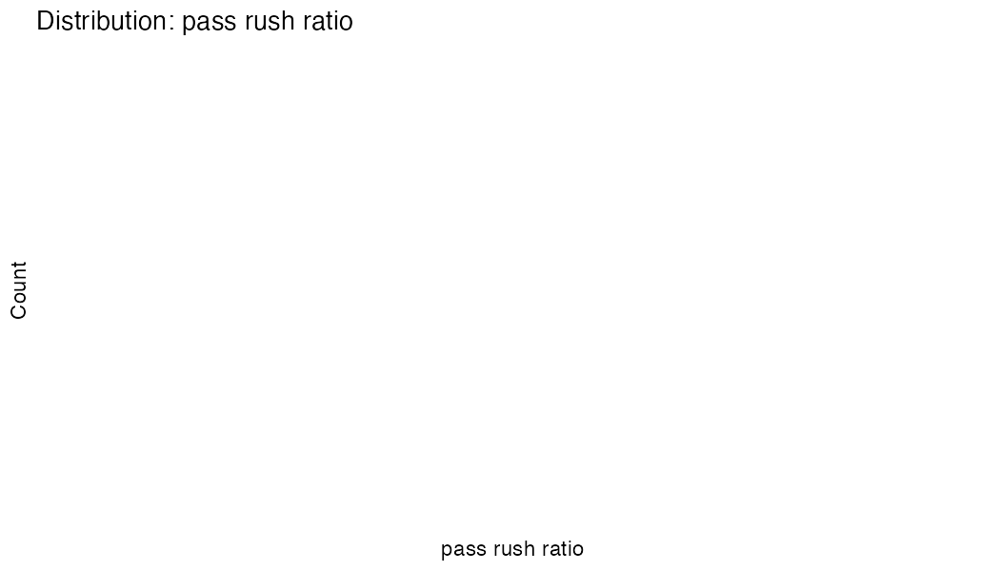
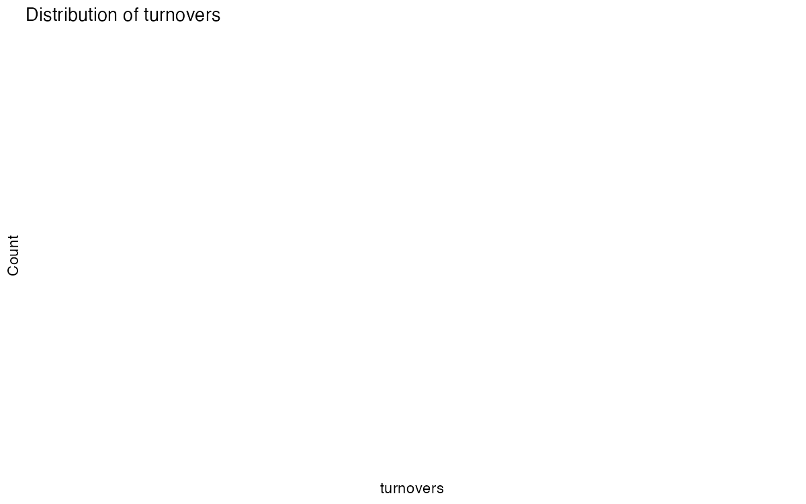

# Univariate Analysis: Offensive Metrics

**Generated:** 2025-11-23 22:59:23

**Focus:** Data quality assessment for ML modeling (XGBoost)

---

## Summary Statistics & Data Quality

| Metric | Mean | Median | SD | Min | Max | Outliers | Skew | Data Quality |

|--------|------|--------|----|----|-----|----------|------|-------------|

| passing yards | 197.3 | 214.5 | 106.1 | 0.0 | 509.0 | 13 (0.7%) | -0.49 | Good |
| rushing yards | 99.1 | 100.0 | 62.8 | 0.0 | 363.0 | 19 (1.0%) | 0.23 | Good |
| passing tds | 1.2 | 1.0 | 1.2 | 0.0 | 6.0 | 1 (0.1%) | 0.79 | Good |
| rushing tds | 0.8 | 0.0 | 0.9 | 0.0 | 5.0 | 113 (5.8%) | 1.12 | High outliers, Skewed |
| turnovers | 1.1 | 1.0 | 1.2 | 0.0 | 6.0 | 2 (0.1%) | 1.03 | Skewed |
| field goals | 1.4 | 1.0 | 1.3 | 0.0 | 7.0 | 6 (0.3%) | 0.72 | Good |
| third down conv | 4.3 | 4.0 | 2.7 | 0.0 | 13.0 | 13 (0.7%) | 0.01 | Good |
| fourth down conv | 0.7 | 0.0 | 0.9 | 0.0 | 5.0 | 99 (5.1%) | 1.33 | High outliers, Skewed |
| long pass | 31.9 | 32.0 | 19.0 | 0.0 | 98.0 | 42 (2.2%) | 0.11 | Good |
| long run | 18.0 | 15.0 | 15.1 | 0.0 | 92.0 | 125 (6.5%) | 1.50 | High outliers, Skewed |
| pass rush ratio | 2.1 | 1.8 | 1.9 | 0.0 | 22.8 | 96 (5.0%) | 2.63 | Skewed |

## Distributions

### passing yards

### rushing yards

### pass rush ratio

### turnovers

## Boxplot Comparison

## Data Quality for ML

**Issues Found:**

- rushing tds: High outliers, Skewed

- turnovers: Skewed

- fourth down conv: High outliers, Skewed

- long run: High outliers, Skewed

- pass rush ratio: Skewed

**XGBoost Recommendations:**

- High outliers: Consider capping/winsorizing

- Skewed: Tree models handle well, log transform for interpretation

- Pass/rush ratio: Division by zero handled (+1 offset)

---
*End*
