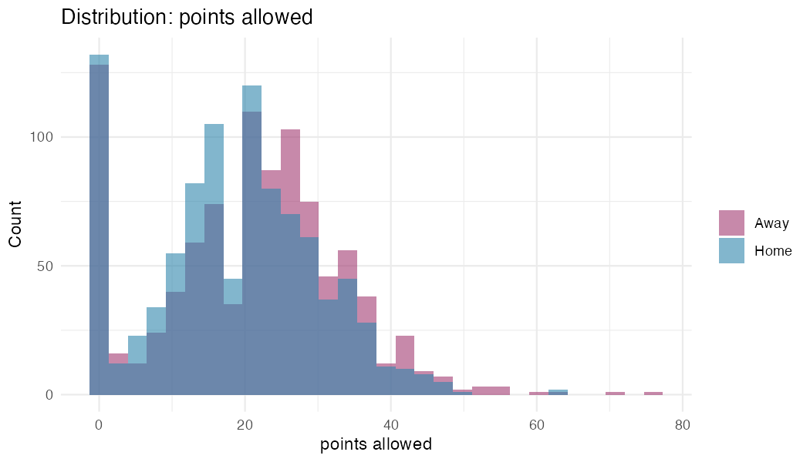
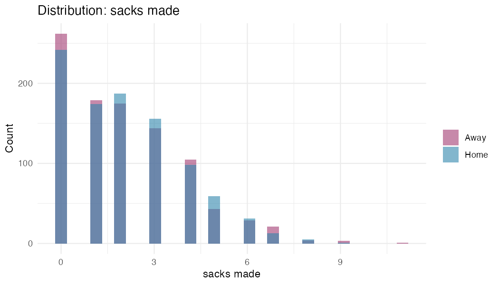
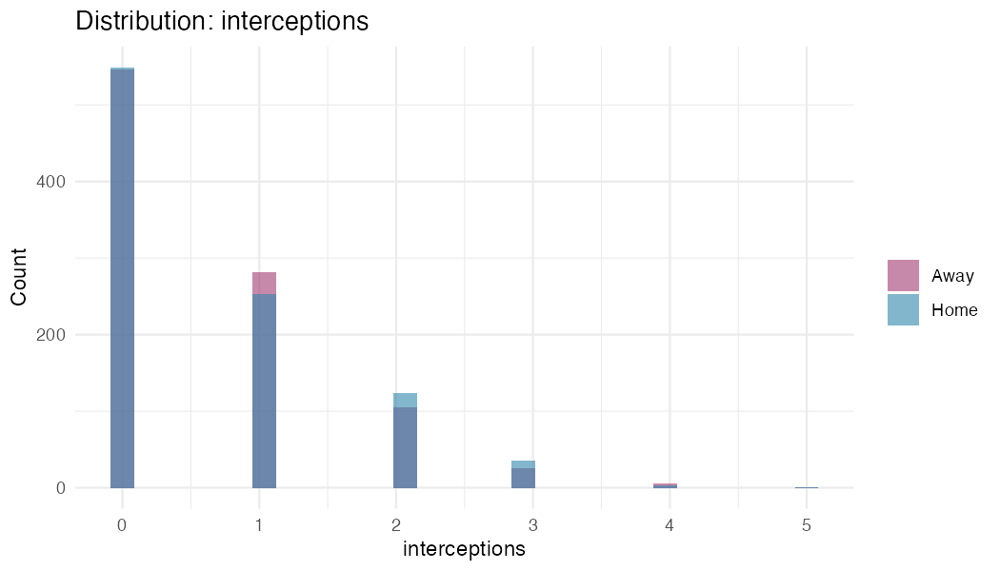
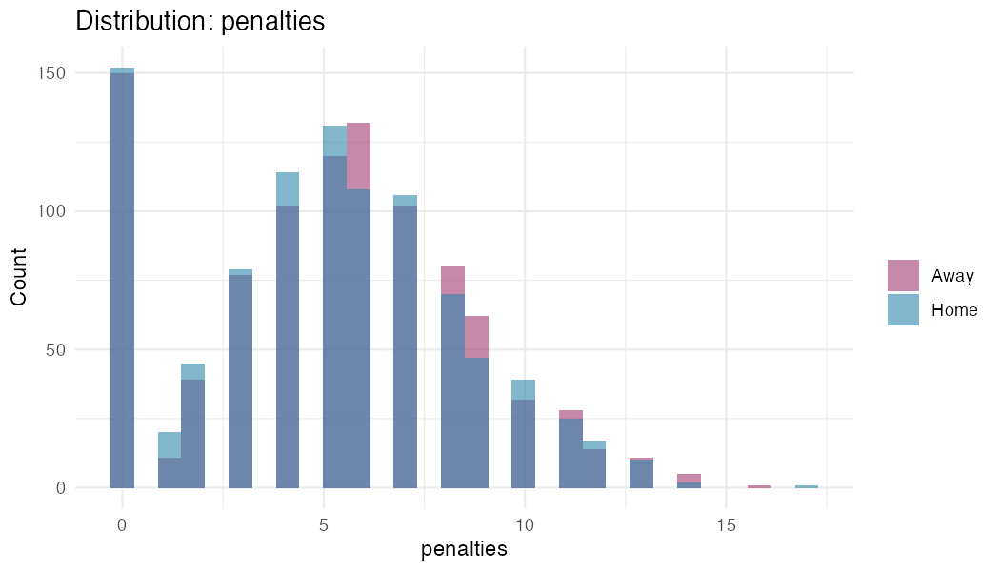
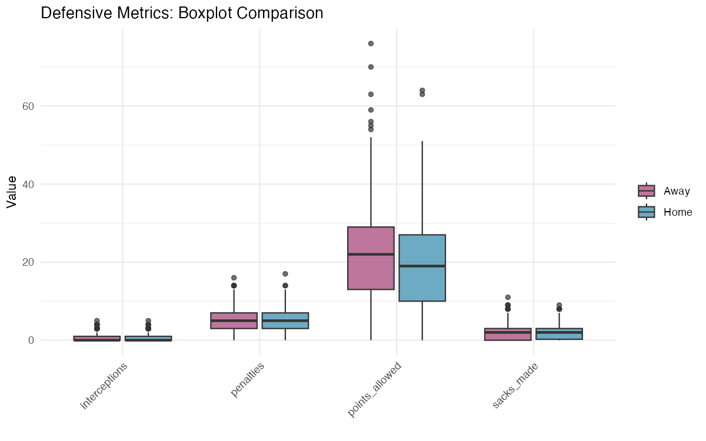

# Univariate Analysis: Defensive & Special Teams Metrics

**Generated:** 2025-11-23 23:19:12

**Focus:** Data quality for ML modeling
---

## Summary Statistics & Data Quality

| Metric | Mean | Median | SD | Min | Max | Outliers | Skew | Quality |

|--------|------|--------|----|----|-----|----------|------|---------|

| sacks made | 2.1 | 2.0 | 1.9 | 0.0 | 11.0 | 14 (0.7%) | 0.85 | Good |

| interceptions | 0.6 | 0.0 | 0.9 | 0.0 | 5.0 | 73 (3.8%) | 1.35 | Skewed |

| fumbles forced | 0.4 | 0.0 | 0.7 | 0.0 | 4.0 | 26 (1.3%) | 1.57 | Skewed |

| qb hits | 4.5 | 4.0 | 3.3 | 0.0 | 17.0 | 4 (0.2%) | 0.42 | Good |

| tackles for loss | 1.9 | 2.0 | 1.7 | 0.0 | 10.0 | 23 (1.2%) | 0.82 | Good |

| penalties | 5.1 | 5.0 | 3.3 | 0.0 | 17.0 | 9 (0.5%) | 0.15 | Good |

| penalty yards | 41.8 | 40.0 | 29.2 | 0.0 | 160.0 | 15 (0.8%) | 0.42 | Good |

| points allowed | 19.8 | 20.0 | 12.1 | 0.0 | 76.0 | 9 (0.5%) | 0.13 | Good |

## Distributions

### points allowed

### sacks made

### interceptions

### penalties

## Boxplot Comparison

## Data Quality for ML

**Issues Found:**

- interceptions: Skewed

- fumbles forced: Skewed

**Recommendations:**

- Defensive stats generally well-behaved for tree models

- Count data (sacks, interceptions) naturally discrete - no transformation needed

- Penalties show natural variation - acceptable for XGBoost

---
*End of Report*
