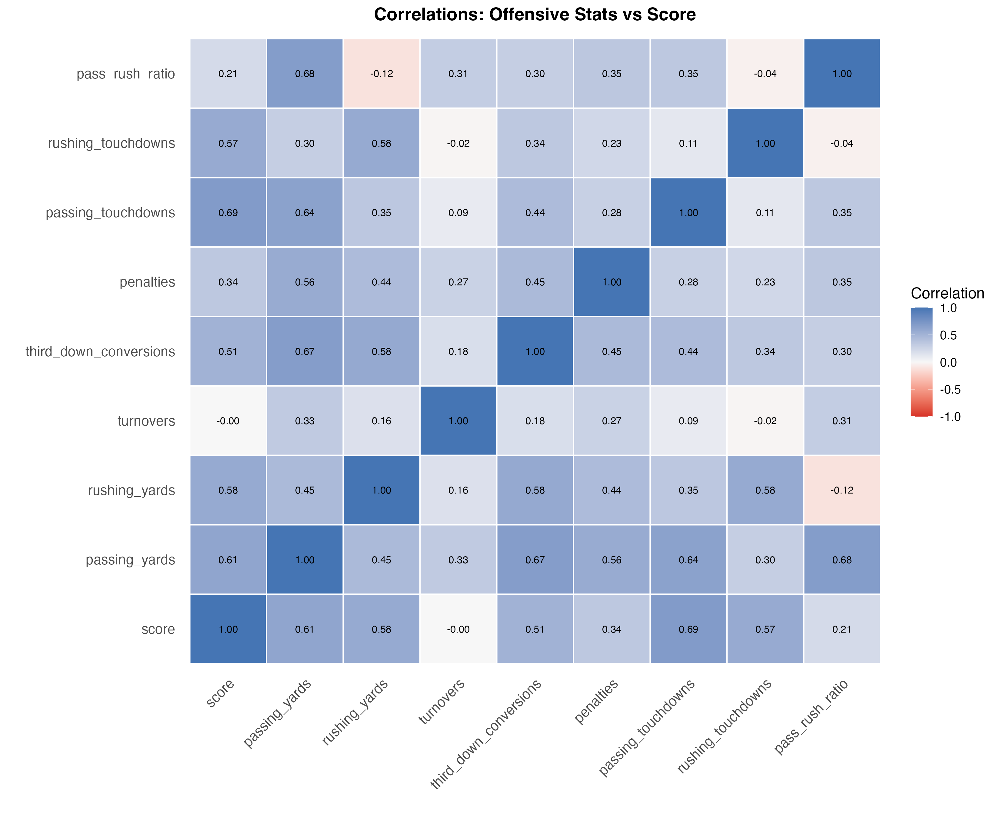

# Comprehensive EDA: NFL Game Statistics

**Focus**: Understanding distributions, relationships, temporal patterns, and data quality

---

## A. Univariate Distributions: Understanding the Data

### Key Statistics Summary

| Variable | Mean | Median | SD | Skew | CV | Interpretation |
|----------|------|--------|----|----|----|--------------|
| home score | 20.9 | 22.0 | 12.4 | -0.01 | 0.60 | Symmetric, high variability |
| away score | 18.6 | 19.0 | 11.4 | 0.04 | 0.61 | Symmetric, high variability |
| home passing yards | 202.1 | 220.0 | 108.8 | -0.52 | 0.54 | Moderately skewed, high variability |
| away passing yards | 192.3 | 207.0 | 103.8 | -0.48 | 0.54 | Symmetric, high variability |
| home rushing yards | 100.0 | 100.5 | 63.5 | 0.24 | 0.64 | Symmetric, high variability |
| away rushing yards | 96.1 | 98.0 | 60.7 | 0.15 | 0.63 | Symmetric, high variability |
| home turnovers | 1.0 | 1.0 | 1.2 | 1.12 | 1.10 | Highly skewed, high variability |
| away turnovers | 1.0 | 1.0 | 1.2 | 1.02 | 1.11 | Highly skewed, high variability |

**Key Insights**:
- Home teams score more (mean= 20.9  vs  18.6 ) - **home field advantage confirmed**
- Passing yards show less variability than scoring (more predictable)
- Turnovers are discrete/skewed (count data) - **no transformation needed for tree models**

## B. Correlations: What Drives Scoring?

**Top 5 Correlates with Scoring**:

1. **passing touchdowns**: r = 0.690 - Strong positive
2. **passing yards**: r = 0.610 - Strong positive
3. **rushing yards**: r = 0.575 - Strong positive
4. **rushing touchdowns**: r = 0.572 - Strong positive
5. **third down conversions**: r = 0.511 - Strong positive

**Key Insights**:
- **Passing TDs and yards** are strongest predictors of scoring
- **Turnovers** negatively correlated (as expected)
- **Penalties positively correlated** (r= 0.34 ) - counterintuitive! This likely reflects:
  - Aggressive offensive play → more penalties but also more scoring
  - High-tempo offenses run more plays → more penalty opportunities
  - Confounding: winning teams may commit more penalties late (protecting lead)
- **Pass:rush ratio** correlation: r= 0.21  - pass-heavy offenses score more
- Efficiency metrics (3rd down) matter more than raw volume stats

## C. Temporal & Contextual Effects

### Season-by-Season Trends

| Season | Games | Home Score | Away Score | Total Score | Pass Yds | Rush Yds |
|--------|-------|------------|------------|-------------|----------|----------|
| 2023 | 285 | 23.4 | 20.4 | 43.8 | 225.6 | 107.5 |
| 2024 | 285 | 24.1 | 21.9 | 46.0 | 224.6 | 115.3 |
| 2025 | 272 | 14.8 | 13.2 | 28.0 | 138.7 | 70.1 |

**Regression Model**: Total Score ~ Season
- Coefficient: -7.90 pts/year (p = 0.4053)
- R²: 0.647
- **Interpretation**:  Scoring decreasing  over time,  not significant 

### Week-of-Season Effects

| Period | Home Score | Turnovers | Penalties |
|--------|------------|-----------|----------|
| Early (1-6) | 23.9 | 1.13 | 6.1 |
| Late (13-18) | 16.2 | 0.82 | 3.8 |
| Mid (7-12) | 22.4 | 1.20 | 5.7 |

**Insight**: Late season shows lower scoring than early season - possibly due to weather or playoff intensity

### Home Field Advantage Analysis

- **Home win rate**: 48.2%
- **Average score advantage**: 2.29 points (t = 4.96, p < 0.0000)
  - 95% CI: [1.38, 3.20] points
- **Passing advantage**: 9.8 yards
- **Rushing advantage**: 3.9 yards
- **Statistical Conclusion**: Home field advantage is  highly significant (p < 0.001) 

## D. Data Quality Issues for ML Modeling

### Missing Data
No missing values in key variables.

### Outliers & Extreme Values

Variables with >5% outliers (IQR method):

### Recommendations for XGBoost
1. **No scaling needed** - tree-based models invariant to monotonic transformations
2. **Count data (turnovers, TDs)** - keep as-is, skewness is natural
3. **Consider feature engineering**: pass/rush ratio, scoring efficiency, turnover differential
4. **Temporal features important**: week, season, home/away all show effects

---
*Analysis complete*
