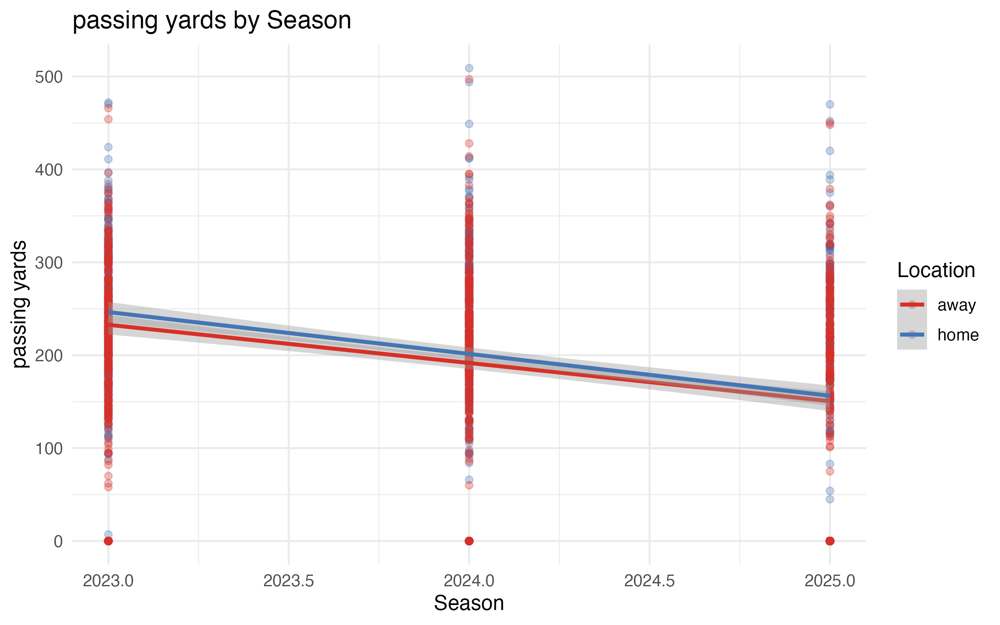
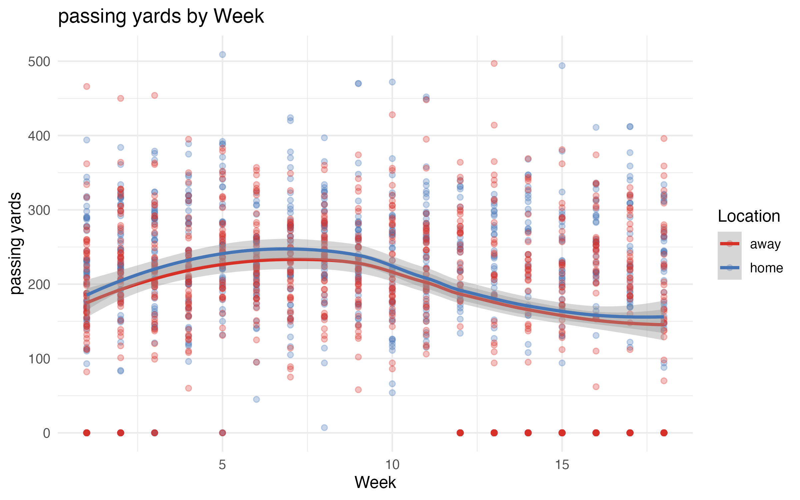
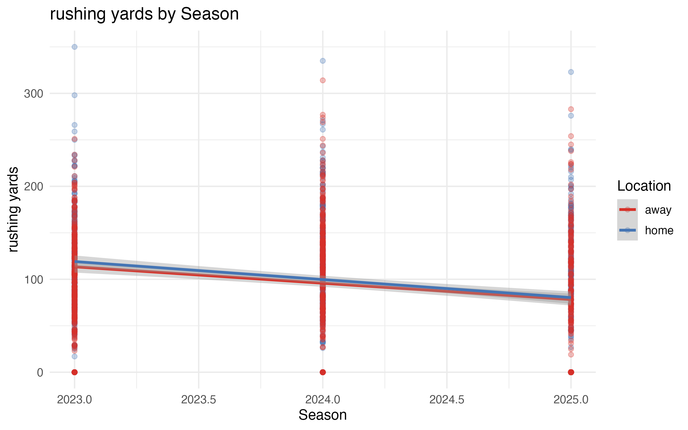
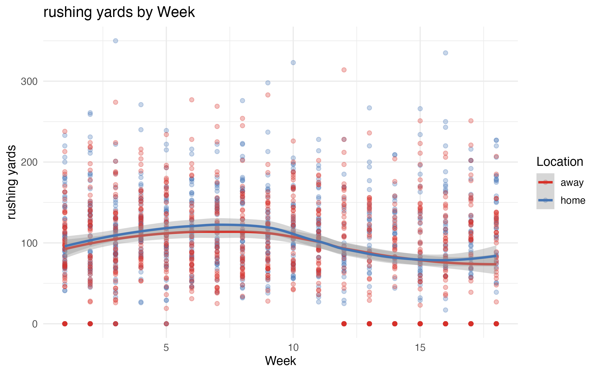
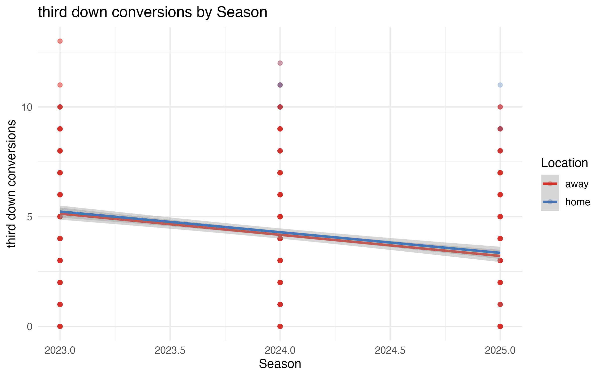

# Comprehensive Regression Analysis

**Model**: Outcome ~ Season × Home/Away × Week (3-way interaction)

**Multiple Comparison Correction**: Bonferroni ( 98 tests)

---

## Model Performance Summary

| Outcome | R² | Adj R² | F-statistic | p-value |
|---------|-----|--------|-------------|----------|
| score | 0.250 | 0.247 | 79.88 | 0.0000 |
| passing_yards | 0.318 | 0.316 | 111.90 | 0.0000 |
| rushing_yards | 0.222 | 0.219 | 68.34 | 0.0000 |
| turnovers | 0.085 | 0.082 | 22.37 | 0.0000 |
| passing_touchdowns | 0.102 | 0.098 | 27.16 | 0.0000 |
| rushing_touchdowns | 0.063 | 0.059 | 16.15 | 0.0000 |
| third_down_conversions | 0.228 | 0.225 | 70.63 | 0.0000 |
| penalties | 0.217 | 0.213 | 66.20 | 0.0000 |
| penalty_yards | 0.181 | 0.178 | 52.91 | 0.0000 |
| sacks_made | 0.124 | 0.121 | 34.04 | 0.0000 |
| interceptions_made | 0.058 | 0.054 | 14.73 | 0.0000 |
| fumbles_forced | 0.042 | 0.038 | 10.40 | 0.0000 |
| qb_hits | 0.186 | 0.182 | 54.57 | 0.0000 |
| tackles_for_loss | 0.130 | 0.127 | 35.93 | 0.0000 |

## Significant Effects (Bonferroni-corrected p < 0.05)

| Outcome | Effect | Estimate | p-value (corrected) |
|---------|--------|----------|---------------------|
| fumbles_forced | season:week | -0.020 | 0.0239 |
| fumbles_forced | week | 39.562 | 0.0239 |
| interceptions_made | season:week | -0.024 | 0.0205 |
| interceptions_made | week | 49.211 | 0.0206 |
| passing_touchdowns | season:week | -0.074 | 0.0000 |
| passing_touchdowns | week | 149.383 | 0.0000 |
| passing_touchdowns | season | 0.562 | 0.0000 |
| passing_yards | season:week | -9.650 | 0.0000 |
| passing_yards | week | 19526.715 | 0.0000 |
| passing_yards | season | 49.666 | 0.0000 |
| penalties | season:week | -0.247 | 0.0000 |
| penalties | week | 499.553 | 0.0000 |
| penalties | season | 1.598 | 0.0000 |
| penalty_yards | season:week | -1.873 | 0.0000 |
| penalty_yards | week | 3788.964 | 0.0000 |
| penalty_yards | season | 11.653 | 0.0000 |
| qb_hits | season:week | -0.196 | 0.0000 |
| qb_hits | week | 396.789 | 0.0000 |
| rushing_touchdowns | season:week | -0.030 | 0.0023 |
| rushing_touchdowns | week | 61.384 | 0.0023 |
| rushing_yards | season:week | -5.048 | 0.0000 |
| rushing_yards | week | 10215.232 | 0.0000 |
| rushing_yards | season | 29.860 | 0.0000 |
| sacks_made | season:week | -0.098 | 0.0000 |
| sacks_made | week | 198.288 | 0.0000 |
| score | season:week | -0.795 | 0.0000 |
| score | week | 1609.076 | 0.0000 |
| score | season | 3.934 | 0.0009 |
| tackles_for_loss | season:week | -0.095 | 0.0000 |
| tackles_for_loss | week | 192.326 | 0.0000 |
| third_down_conversions | season:week | -0.216 | 0.0000 |
| third_down_conversions | week | 437.195 | 0.0000 |
| third_down_conversions | season | 1.068 | 0.0000 |
| turnovers | season:week | -0.054 | 0.0000 |
| turnovers | week | 109.061 | 0.0000 |

## Key Findings & Stories

### 1. passing_yards: season:week effect
- **Estimate**: -9.650
- **p-value**: 0.0000 (original), 0.0000 (Bonferroni)
- **Significant after correction**: ✓ Yes

### 2. passing_yards: week effect
- **Estimate**: 19526.715
- **p-value**: 0.0000 (original), 0.0000 (Bonferroni)
- **Significant after correction**: ✓ Yes

### 3. rushing_yards: season:week effect
- **Estimate**: -5.048
- **p-value**: 0.0000 (original), 0.0000 (Bonferroni)
- **Significant after correction**: ✓ Yes

### 4. rushing_yards: week effect
- **Estimate**: 10215.232
- **p-value**: 0.0000 (original), 0.0000 (Bonferroni)
- **Significant after correction**: ✓ Yes

### 5. third_down_conversions: season:week effect
- **Estimate**: -0.216
- **p-value**: 0.0000 (original), 0.0000 (Bonferroni)
- **Significant after correction**: ✓ Yes

---
*Analysis complete*
